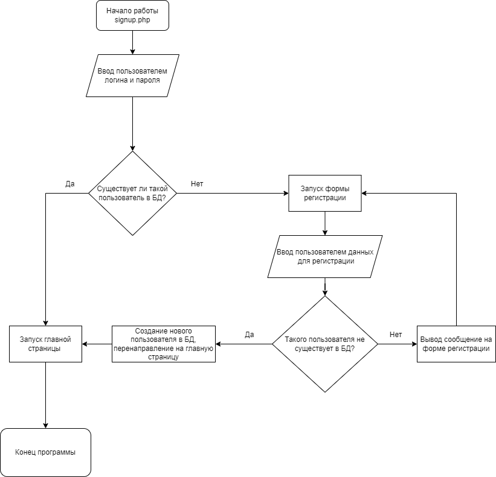

# Отчет о курсовой работе
####  по курсу "Основы программирования"
##### *Работу выполнил студент группы №3131 Федоров Григорий*

## Изучение предметной области  
Реализация входа на сайт с помощью почты и пароля, а также возможность доступа зарегистрированному пользователю к общему списку дел. Для всех пользователей доступна цитата, которая находится на отдельной странице. 
  
## Составление задач

* Система авторизации и выхода из аккаунта.
* Регистрация на сайте.
* Общий список дел, в котором есть различные сценарии.
* Просмотр цитаты и ее копирование.
* Чтение цитаты вслух.  
  
## Выбор технологий:  
  
*Среда разработки и языки программирования:*

Visual Studio Code; PHP, Html, JavaScript.  
  
*Библиотеки:*

https://stackpath.bootstrapcdn.com/bootstrap/4.5.2/css/bootstrap.min.css  
https://fonts.googleapis.com/css?family=Poppins:400,500,600,700&display=swap
http://api.quotable.io/random  

## Реализация поставленных задач  
  
#### Пользовательский интерфейс:  

* Форма входа:

* Форма регистрации:

* Главная страница:

* Общий список дел:

* Цитата:   

    
## Пользовательские сценарии:

Пользователь заходит на сайт, его перекидывает на форму входа/регистрации (login.php). Там пользователь входит в свою учётную запись через логин и пароль, при необходимости предварительно зарегистрировавшись, или переходит на страницу с цитатами. После входа он попадает на главную страницу (index.php), где он может выйти из аккаунта или перейти к списку общих дел.

## API сервера:

При регистрации/авторизации пользователя используются POST-запросы c полями login, password, email и cpassword.   
  
Для работы с библиотекой http://api.quotable.io/random используется AJAX запросы к сайту, содержащему цитаты.  
Для шрифтов используется https://stackpath.bootstrapcdn.com/bootstrap/4.5.2/css/bootstrap.min.css  и https://fonts.googleapis.com/css?family=Poppins:400,500,600,700&display=swap

## Хореография:

home.php, при отсутствии переменной $_SESSION['name'], перенаправляет пользователя на страницу login-user.php. Если переменная есть, то перенаправление не происходит. При нажатии на кнопку Logout сервер отправляет запрос в logout-user.php (в результате запроса перемения $_SESSION['name']) будет уничтожена и направляет пользователя на login-user.php.

Со страницы signup-user.php, при нажатии кнопки "signup", сервер отправляет запрос на controllerUserData.php (тут данные будут проверены и, если всё соответствует критериям, внесены в БД), передавая туда введённые в поля "Имя", "Email", "Пароль" и "Подтвердите пароль" данные. signup-user.php после обработки данных возвращает индикатор, в зависимости от значения которого будет выведено сообщение об ошибке или успешной регистрации и перенаправит на login-user.php. Также при нажатии на ссылку "login here" пользователь перейдет на старницу login-user.php

При нажатии на странице login-user.php кнопки "login", сервер направит на controllerUserData.php запрос с введёнными данными. controllerUserData.php проверяет данные на корректность и возвращает индикатор, в зависимости от значения которого будет выведено сообщение об ошибке или пользователь получит переменную $_SESSION['user']) и будет перенаправлен на home.php. Если пользователь нажал на ссылку "signup now", то он будет перенаправлен на signup-user.php, а если на вторую ссылку "quote", то перенаправлен на страницу index1.html, где сможет посмотреть и выбрать нужную цитату. 

Кроме того, на странице index1.html пользователь может скопировать цитату или прочесть её вслух с помощью кнопок. Также он может вернуться на страницу login-user.php с помощью кнопки "Go to login!" или обновить цитату, нажав на кнопку "New quote".

## Структура базы данных:   
  
* "id" типа int с автоинкрементом для выдачи уникальных id всем пользователям
* "name" типа varchar для хранения имени(логина) пользователя
* "password" типа varchar для хранения пароля пользователя в виде хеша

## Алгоритмы:  
  
  * Алгоритм работы для форм signup-user.php и register-user.php:

  
  
  * При нажатии на кнопки Go to login!, Sign up now, login here:  

  
